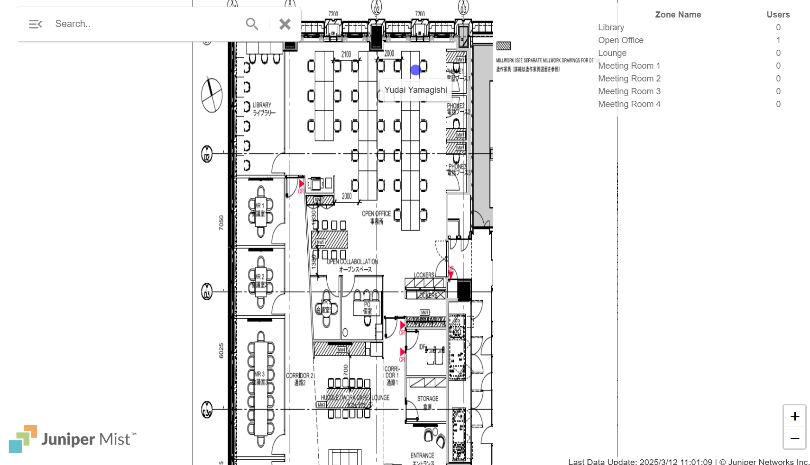
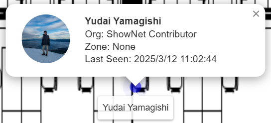
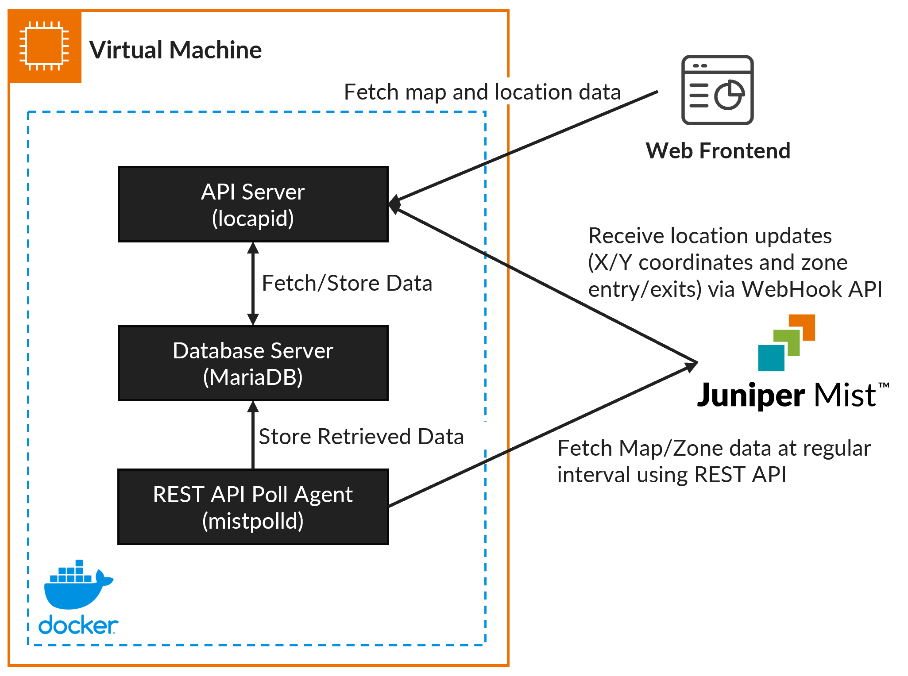

# Mist Location Visualization Demo



This is a sample web application which shows the real-time location of BLE beacons tracked through [Juniper Mist](https://www.juniper.net/us/en/products/mist-ai.html).
Example use-cases of this application include real-time tracking of BLE-enabled equipment and office workers who have BLE beacons.
This web application was used to demonstrate the capability of Mist's BLE-based location functionality at the [Interop Tokyo 2024](https://www.interop.jp/) event.



This web application shows the location of BLE devices that are registered as assets in Juniper Mist.
Detailed information about the asset can be displayed by clicking each asset on the map.
If an asset is named using the format `[Organization] Name`, the web application will split the organization and name, and visualize them accordingly.
If an avatar image is available, it will also display the avatar image of the device.

## Components

This application has 3 major components:

- **Frontend Web Application**: The frontend UI component which consists of HTML/JS/CSS
- **Backend Mist Poll Agent (mistpolld)**: A backend daemon responsible for polling Juniper Mist's REST API to synchronize map and zone information at regular intervals
- **Backend API Server (locapid)**: A backend daemon responsible for responding to API calls from the frontend UI, as well as receiving WebHook API calls from Juniper Mist. Mist sends location updates of registered assets over the WebHook API. The API server stores the location data in the database and provides responses to API calls from the frontend UI

The diagram below illustrates how these components work together:



## How to Use

### 1. Setting Up the Frontend Web Application

1. Upload the contents of the `web/` directory to a web server and make it publicly accessible (e.g., AWS S3 with CloudFront)
2. Upload the map image to the `img/map/` directory and name the image as `<mapId>.png`
   - Map ID can be retrieved by accessing the live location view inside the Juniper Mist console
   - When you access the live view of any floor, the URL will look like this:
     ```
     https://manage.mist.com/admin/?org_id=a82eebc1-65d0-4355-8122-39733cd47d34#!cliLocation/view/cd7c2682-4588-4eca-a23c-067c758472f9/a84f4847-cdc2-4e96-9117-a6747edf32f1
     ```
   - In this case, the map ID is `cd7c2682-4588-4eca-a23c-067c758472f9` and you should save the map image as `img/map/cd7c2682-4588-4eca-a23c-067c758472f9.png`
3. (Optional) Upload user avatars to the `img/user/` directory
   - Avatar images should be named as `<bleMac>.png`
   - For example, if you have a BLE beacon with MAC `00:11:22:33:44:55`, the avatar image should be saved as `img/user/0011223344gg.png`
   - If an avatar image is not provided, the web UI will use the default image (`user_generic.svg`)
4. Change the API endpoint defined in `js/location_demo.js`
   - The `API_ENDPOINT` configuration variable needs to be changed to the location where `locapid` is running

### 2. Setting Up the Backend

Backend applications are built as Docker containers and Docker Compose can be used to spin up the docker containers.

> **Note**: HTTPS is not supported by locapid. However, having HTTPS is recommended for security, so a reverse proxy (e.g., nginx, AWS API Gateway) should be placed in front of locapid.

1. Build the Docker container by executing `make container` in the root directory of this repository
2. Create data directories for locapid and mistpolld:
   ```bash
   mkdir -p deployments/locapid deployments/mistpolld
   ```
3. Copy the configuration template for each daemon to its respective data directory:
   ```bash
   cp locapid.config.json deployments/locapid/config.json
   cp mistpolld.config.json deployments/mistpolld/config.json
   ```
4. Edit the configuration file for locapid (`deployments/locapid/config.json`):
   - Mist API endpoint variable should be changed according to your Mist region.
     Consult the [Juniper Mist documentation](https://www.juniper.net/documentation/us/en/software/mist/automation-integration/topics/topic-map/api-endpoint-url-global-regions.html) for the API endpoint
   - Mist API key variable should be changed to your API key with minimum Observer level access to your organization.
     For creating an API key, consult the [Juniper Mist documentation](https://www.juniper.net/documentation/us/en/software/mist/automation-integration/topics/task/create-token-for-rest-api.html#task_e15_krd_qjb)
   - Mist API secret variable should be changed to a random string. This is used to authenticate incoming WebHook API calls from Mist to locapid. Each WebHook API request from Mist will contain an authentication signature signed using this secret. locapid will use the configured secret to verify that the WebHook API call is made from Juniper Mist
   - Database configurations should be changed accordingly. If you are using an external MariaDB server, the database configuration should point to the external MariaDB server. If you are running MariaDB locally, the access credentials should match the credentials configured in the Docker Compose deployment file
5. Edit the configuration file for mistpolld (`deployments/mistpolld/config.json`):
   - Mist API endpoint variable should be changed according to your Mist region.
     Consult the [Juniper Mist documentation](https://www.juniper.net/documentation/us/en/software/mist/automation-integration/topics/topic-map/api-endpoint-url-global-regions.html) for the API endpoint
   - Mist API key variable should be changed to your API key with minimum Observer level access to your organization.
     For creating an API key, consult the [Juniper Mist documentation](https://www.juniper.net/documentation/us/en/software/mist/automation-integration/topics/task/create-token-for-rest-api.html#task_e15_krd_qjb)
   - Database configurations should be changed accordingly. If you are using an external MariaDB server, the database configuration should point to the external MariaDB server. If you are running MariaDB locally, the access credentials should match the credentials configured in the Docker Compose deployment file
   - Datasource URI variable should be changed to retrieve data for sites which you want to display the location for. The sample URI contains a site ID embedded in the URI. For example, if your site ID is `a84f4847-cdc2-4e96-9117-a6747edf32f1`, you will need to change `xxxxxxxx-xxxx-xxxx-xxxx-xxxxxxxxxxx` to `a84f4847-cdc2-4e96-9117-a6747edf32f1`
6. Edit the Docker Compose deployment file (`deployments/docker-compose.yml`):
   - If you are using an external MariaDB server, remove all references to the mariadb container. Make sure to remove mariadb from the dependencies of locapid and mistpolld
   - If you are running MariaDB server locally, change the credentials to match the credentials configured in locapid and mistpolld configuration
7. Launch the containers:
   ```bash
   cd deployments
   docker compose up -d
   ```
8. Make sure locapid is publicly accessible by running an API call:
   ```bash
   curl http://<public-ip>/map
   [{"id":"cd7c2682-4588-4eca-a23c-067c758472f9","name":"11F","width":1005,"height":1303}]
   ```

### 3. Setting Up Mist

You will need to configure Mist to send location updates to your locapid endpoint.
For more information, please reference the [Juniper Mist documentation](https://www.juniper.net/documentation/us/en/software/mist/automation-integration/topics/concept/webhooks-configure-portal.html).

1. Go to `Organization->Site Configuration` from your Mist organization dashboard
2. Under the WebHook configuration, click `Add Webhook`
3. Inside the WebHook configuration screen, configure the WebHook as follows:
   - **Status**: Enabled
   - **Webhook Type**: HTTP Post
   - **Name**: Can be any name you choose
   - **URL**: `http://<locapid-endpoint>/mistrecv`
   - **Topics**: Standard->Entry/Exit Events->Location Zone and Standard->X/Y Coordinates->Named Assets
   - **Settings->Secret**: Secret key configured in locapid configuration file

## Legal

This application is provided as a reference only and not for production use. By using this application, you agree that neither the author of this code nor Juniper Networks can be held accountable for any damage caused by the use of this code.

